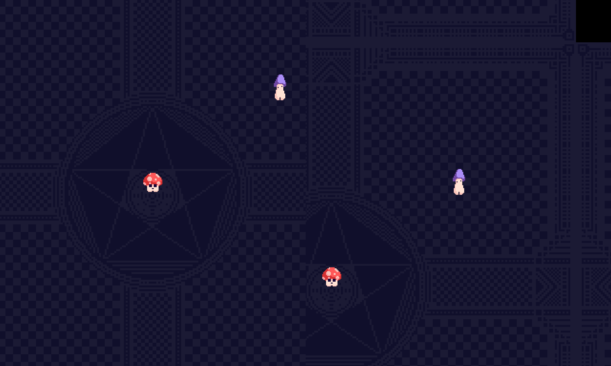
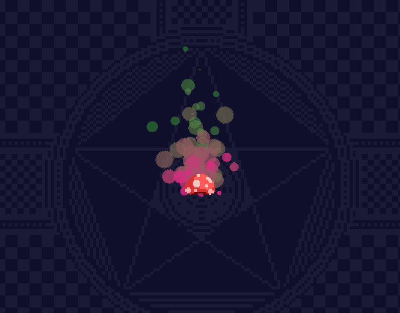

# Aprofundamento em LOVE

Ok, agora que já entendemos como funciona o básico do LÖVE, como sua inicialização, a leitura de inputs e a renderização de assets, vamos abordar alguns outros tópicos importantes para a criação de um bom jogo.

O plano é:

- Falaremos sobre como usar **Sprite Sheets** para criar animações;
- Depois, vamos falar sobre o uso de **Canvas** para renderizar certos elementos em suas próprias "janelas virtuais";
- Em seguida, vamos ver um pouco de **Particle Systems** (Sistemas de Partícula);
- Então, vamos falar um pouquito sobre **Threads** do LOVE, e
- Por fim, vamos bater um papinho final sobre desenvolvimento de jogos, Love2D, e para onde ir agora que você concluiu o curso.

Para explicar essas coisas, vou utilizar exemplos reais de um jogo que estou desenvolvendo, chamado "MushRooms". Contudo, como você - leitor - não possui o contexto inteiro do código do jogo, vou tomar o máximo de cuidado nas explicações e tentar não te deixar perdido.

Parece bom? Então bó

## Animações com Sprite Sheets

Na introdução a Love, nós vimos que é possível renderizar uma "animação" separando seus frames em imagens diferentes e então desenhando elas uma de cada vez. Contudo, esse processo é muito limitado, desorganizado e demorado. Ao invés de fazer isso toda vez que quisermos adicionar uma animação para nosso jogo, vamos usar a estratégia dos verdadeiros desenvolvedores de jogos: **_sprite sheets_**.

Sprite sheets são imagens que reúnem todos os frames de uma ou mais animações. Os frames ficam alinhados em fileiras e colunas, então o que nós fazemos para renderizar uma animação usando sprite sheets é iterar sobre essas fileiras de frames.


Então vamos ver na prática um exemplo de como sprite sheets são usadas em um sistema de animação. Aqui em baixo temos o código da declaração de uma classe "Animation", responsável por gerenciar animações em um jogo:

``` Lua
Animation = {}
Animation.__index = Animation

function Animation.new(frames, frameDur, looping, loopFrame, frameDim)
	local animation = setmetatable({}, Animation)

	-- atributos que variam
	animation.frames = frames       -- número de frames na animação
	animation.frameDur = frameDur   -- duração de cada frame em segundos
	animation.looping = looping     -- se a animação é ciclica ou não
	animation.loopFrame = loopFrame -- a partir de qual frame a animação é ciclica
	animation.frameDim = frameDim   -- dimensões de cada frame
	-- atributos fixos na instanciação
	animation.currFrame = 1         -- frame atual
	animation.timer = 0             -- tempo decorrido desde a última mudança de frame	
	
	return animation
end
```

Como você pode ver, os objetos dessa nossa classe vão guardar praticamente todas as informações necessárias para rodarmos uma animação (que possivelmente loopa a partir de um ponto arbitrário). A função construtora de animações, contudo, é um pouco mais complexa, vamos dar uma olhada nela:

``` Lua
function newAnimation(path, length, quadSize, frameDur, looping, loopFrame, frameDim)
	local sheetImg = love.graphics.newImage(path)
	local frames = {}
	local gap = 4
	local sWidth = sheetImg:getWidth()
	local sHeight = sheetImg:getHeight()
	local qWidth = quadSize.width
	local qHeight = quadSize.height
	local i = 0

	for y = 0, sHeight - qHeight, qHeight + gap do
		for x = 0, sWidth - qWidth, qWidth + gap do
			i = i + 1
			if i > length then goto createanimation end

			table.insert(frames, love.graphics.newQuad(x, y, qWidth, qHeight, sWidth, sHeight))
		end
	end

	::createanimation::
	return Animation.new(frames, frameDur, looping, loopFrame, frameDim)
end
```

Bom, para entendermos ela melhor, vamos ver o que é cada uma dessas variáveis que nós inicializamos no início da função:

- *sheetImg:* a imagem que contém a sprite sheet inteira, ela é criada usando a função `love.graphics.newImage()` que nós já vimos antes, passando-se o caminho para o arquivo da sprite sheet.
- *frames:* é uma lista de Quads (já vamos ver o que é isso), cada um representando a área na sprite sheet referente a um frame específico. Lembre-se que os frames ficam alinhados um do lado do outro na sprite sheet.
- *gap:* em muitas sprite sheets, incluindo as desse jogo, há um espaçamento entre os frames da animação, nesse caso o espaçamento é de 4 pixels.
- *sWidth:* a largura da sprite sheet em pixels.
- *sHeight:* a altura da sprite sheet em pixels.
- *qWidth:* a largura de cada frame (e portanto de cada `Quad`) em pixels.
- *qHeight:* a altura de cada frame (e portanto de cada `Quad`) em pixels.
- *i:* um contador que contabilizará frames.

A próxima parte do código - o loop duplo - não passa de uma etapa de preenchimento da array `frames` com os _Quads_ de cada frame. A palavra "Quads" vem de "quadrilátero". Ou seja, `Quads` são regiões quadriláteras de uma textura (imagem), e são a forma como nós subdividimos uma sprite sheet em seus frames. A função `love.graphics.newQuad()` cria um `Quad` para nós, recebendo como argumentos as coordenadas do quad na textura de referência, suas dimensões e as dimensões da textura de referência.

Em suma, esse loop duplo cria regiões retangulares que designam nossos frames, começando pelo canto superior esquerdo da sprite sheet e scaneando ela da esquerda para a direita, cima para baixo, até que o fim da imagem seja alcançado ou que `i` ultrapasse o número de frames da nossa animação. Ao fazer isso, os quads vão sendo colocados em nossa array `frames`, que posteriormente será útil como você bem verá.

Agora vamos ver como de fato renderizar as animações. Tudo gira em torno do método `update` da classe "Animation". Esta função recebe um `dt` (delta time, o tempo entre o último frame e o atual) e atualiza nossa animação de acordo.

``` Lua
function Animation:update(dt)
    self.timer = self.timer + dt
    -- se já tiver passado a duração de um frame
    if self.timer > self.frameDur then
    	-- reseta o timer
        self.timer = 0
        -- e passa para o próximo frame
        self.currFrame = self.currFrame + 1
        -- se já tiver passado do último frame
        if self.currFrame > #self.frames then
        	-- volta pro primeiro frame de loop se a animação for ciclica
            self.currFrame = self.looping and self.loopFrame or #self.frames
        end
    end
end
```

Ok, então temos uma forma de criar animações e uma forma de rodar elas, então bora ver esse sistema sendo usado na prática.

Neste jogo, as sprite sheets de um personagem (as imagens de suas animações de caminhada, defesa, etc) são guardadas na própria instância do personagem (uma decisão questionável, eu sei...), e as animações também são guardadas no personagem. Tanto as sprite sheets quanto as animações em si são guardadas em uma tabela, mais ou menos assim:

``` Lua
function Player.new(argumentos bla bla bla)
	local player = setmetatable({}, Player)

	-- { outras propriedades... }

	player.state = IDLE      -- define o estado atual do jogador, estreitamente relacionado às animações
	player.spriteSheets = {} -- no tipo imagem do love
	player.animations = {}   -- as chaves são estados e os valores são Animações

	return player
end
```

Como dizem os comentários, o `player.state` guarda o estado atual do jogador (como "parado", "caminhando", "atacando", etc). Como cada estado tem sua própria animação, usamos os estados como chaves para as tabelas de sprite sheets e de animações. Logo, em nossa função `love.update(dt)`, fazemos algo do gênero:

``` Lua
function love.update(dt)
	-- { fazendo outras coisas }
	-- ...
	player.animations[player.state]:update(dt)
end
```

E por fim, em nossa função `love.draw()`, chamamos uma função que renderiza o jogador, que por sua vez faz algo assim:

``` Lua
-- aqui, p é o player
local animation = p.animations[p.state]
local quad = animation.frames[animation.currFrame]
love.graphics.draw(p.spriteSheets[p.state], quad, p.x, p.y)
```

Neste trecho de código, que é o que na prática desenha o jogador na tela em sua posição correta e no frame correto da animação correta, nós fazemos o uso de tudo que vimos nesta seção: a classe `Animation`, `Quads` e - é claro - **Sprite Sheets**.

## Canvas e split-screen

Um **canvas** é uma espécie de "janela virtual para renderização". Basicamente, da mesma forma que você geralmente renderiza formas, imagens, animações e tudo mais em uma **janela**, você pode renderizar em um canvas. E então, você pode _renderizar um canvas em uma janela_, ou renderizar um canvas em outro canvas, e assim em diante. Os canvas não são visíveis a princípio, então até que você renderize eles na janela de sua aplicação, qualquer coisa presente neles não aparecerão em lugar nenhum.

Para o conceito "canvas" ficar mais claro, vou dar um exemplo. Vamos supor que você queira que seu jogo tenha um mini-mapa no canto da tela. Ao invés de você renderizar cada parte de mini-mapa diretamente na tela, você pode renderizá-las em um canvas e então renderizar este canvas na tela de uma vez só.

Para criar um novo canvas, utilizamos a função `love.graphics.newCanvas()`, passando como argumentos a largura e a altura do canvas que queremos. Esta função nos retornará um objeto `Canvas`, o qual nós veremos como usar agora.

O processo de usar um canvas é relativamente simples. Uma vez que você criou seu canvas, basta que, dentro da função `love.draw()`, você **ative** seu canvas, **desenhe nele** e depois **desenhe ele na tela**.

``` Lua
-- ativando o canvas
love.graphics.setCanvas(canvas)
-- desenhando algo nele (um mini mapa, por exemplo...)
love.graphics.draw(minimap, minimap.x, minimap.y)
-- desativando o canvas (ou ativando o canvas da janela inteira)
love.graphics.setCanvas()
-- desenhando o canvas na janela
love.graphics.draw(canvas, canvasPos.x, canvasPos.y)
```

Aqui, nós usamos apenas uma nova função, mas que nos serviu dois propósitos: a `love.graphics.setCanvas()`. Quando ela é chamada recebendo um canvas como argumento, ela ativa este canvas, e a partir de então qualquer operação de renderização é aplicada no canvas ativo. Contudo, quando ela é chamada sem receber argumentos, ela ativa o "canvas padrão", digamos assim, que é a própria janela na qual seu jogo está rodando.

Na última linha, veja que nós estamos renderizando o canvas como se ele fosse uma imagem: usando a função `love.graphics.draw()`.

Simples, não? Bem, esta ferramenta, apesar de simples, nos abre algumas janelas (ba dum - tsss) que antes seriam muito inacessíveis. Por exemplo, agora podemos implementar **Split Screen** em nossos jogos. Basta que a visão de cada jogador seja desenhada em seu próprio canvas, e então os canvas sejam desenhados em suas respectivas posições na tela.

Caso você viva em baixo de uma estrela do mar que vive em baixo de uma pedra, _split screen_ é uma forma de exibir múltiplas perspectivas em uma única tela dividindo-a em seções. Se você já viu como a tela de Mario Kart fica quando mais de uma pessoa está jogando no mesmo console/computador: isso é split screen.

No jogo que estou implementando, por exemplo, tenho uma classe chamada `Camera`. Cada instância de câmera segue o personagem de um jogador. Para que o split screen deste jogo funcione, eu associei um canvas a cada câmera. Dessa forma, na função `love.draw()`, algo do tipo acontece:

``` Lua
function love.draw()
	-- iterando por todas as câmeras, cada uma possui um canvas e segue um jogador
	for i, c in pairs(cameras) do
		love.graphics.setCanvas(c.canvas)
		love.graphics.clear(0.0, 0.0, 0.0, 1.0)
		renderWorld(i)
		renderPlayers(i)
		love.graphics.setCanvas()
		love.graphics.draw(c.canvas, c.canvasPos.x, c.canvasPos.y)
	end
end
```

Se você prestou atenção nos exemplos de código anteriores, este trecho não deve te surpreender muito. Tudo que estamos fazendo aqui é seguir as etapas do uso de canvases (?).

1. Ativar o canvas
2. Renderizar o conteúdo do canvas
3. Desativar o canvas
4. Desenhar o canvas na tela

Não entrarei nos detalhes da implementação da classe `Camera` ou das funções `renderWorld()` e `renderPlayers()`, pois isto exigiria muito tempo e não incrementaria muito em seu conhecimento sobre Love2D, mas vou anexar aqui uma imagem do split screen funcionando:



Na esquerda temos a câmera do personagem **Mush**, e na direita temos a câmera do personagem **Shroom**. Conforme eles se mexem, as câmeras os acompanham. É isso! :D

## Sistemas de Partículas

Algo muito bacana que o Love2D oferece em sua API é o **Sistema de Partículas** (_Particle Systems_). Isto se trata de uma forma de gerar efeitos dinâmicos com partículas para embelezar o seu jogo, tornando a criação de efeitos visuais de fumaça, fogo, _brilhinhos_ - entre outros - muito mais fácil.

Como exemplo, vamos implementar aqui um efeito de "gás tóxico" sendo emitido de um dos personagens do jogo utilizando sistemas de partícula.

Para criar um efeito de partículas, basta chamar chamar a função `love.graphics.newParticleSystem()` passando como argumentos uma **imagem** (que será a forma de nossas partículas) e um número (representando o limite de partículas simultâneas que seu sistema de partículas vai suportar). Assim:

``` Lua
local particleImg = love.graphics.newImage("assets/sprites/circle.png")
local particles = love.graphics.newParticleSystem(particleImg, 250)
```

Após criar nosso sistema de partículas, iremos querer configurá-lo para que ele se comporte como esperamos. Por exemplo, você pode querer que seu sistema emita poucas ou MUITAS partículas por segundo. Você pode querer que as partículas subam ou descam. Você pode querer que elas girem, que elas mudem de tamanho enquanto se movem, que elas mudem de cor, enfim... Os sistemas de partícula são muito versáteis, e com os métodos que manipulam _Particle Systems_ você pode controlar tudo isso. Vou aqui listar alguns dos métodos mais importantes para se personalizar seu sistema de partículas e dizer para quê cada um deles serve (`ps` aqui é sua instância de sistema de partículas:

- `ps:setParticleLifetime(min, max)`: define o tempo de vida das partículas. Ou seja, elas durarão no mínimo `min` segundos e no máximo `max` segundos. Este método é obrigatório para que o sistema de partículas seja usado. 
- `ps:setEmissionRate(x)`: define quantas partículas por segundo serão emitidas pelo sistema. Este método também é obrigatório para que o sistema de partículas seja usado.
- `ps:setPosition(x, y)`: define a posição do sistema de partículas.
- `ps:setSizes(s1, s2, ...)`: define o tamanho (ou escala) das partículas ao longo da existência delas. Ou seja, elas começam com tamanho `s1`, crescem ou diminuem até chegar em `s2`, depois para `s3` e assim em diante. Sendo que estes argumentos são algum número entre 0 e 1, que definem a escala da partícula com base no tamanho original da imagem (se a imagem tinha tamanho `200x400` e `s1` é `0.5`, a partícula começará com tamanho `100x200`).
- `ps:setSpin(min, max)`: define a velocidade de rotação das partículas para ser algo entre `min` e `max`. Os parâmetros devem ser passados em radianos. Ou seja, se `min` for `math.pi`, as partículas irão rotacionar em no mínimo 180° por segundo.
- `ps:setColors(r1, g1, b1, a1, r2, g2, b2, a2)`: a cor que as partículas vão assumir ao longo de sua vida. Elas surgem com a cor em rgba obtida com os argumentos `r1`, `g1`, `b1`, `a1` e então transiciona para os próximos valores rgba e assim em diante.
- `ps:setLinearAcceleration(xmin, ymin, xmax, ymax)`: define a aceleração das partículas na horizontal e na vertical. Valores negativos na horizontal acelerarão as partículas para a esquerda e valores negativos na vertical acelerarão as partículas para cima.
- `ps:setDirection(rad)`: define a direção na qual as partículas serão emitidas. O argumento é passado como radianos. 0 radianos aponta para a direita, radianos positivos vão girando em sentido horário e radianos negativos vão girando em sentido anti-horário.
- `ps:setSpread(rad)`: define a abertura da emissão de partículas. O argumento é passado em radianos. Ou seja, se você passar `math.pi/2` como argumento, as partículas serão emitidas em um "cone" com abertura de 90°.
- `ps:setEmissionArea(mode, width, height)`: define a área em que as partículas podem surgir. Quanto maior a área, mais longe umas das outras as partículas surgirão, e quanto menor a área, mais concentradas elas estarão ao surgirem. O modo define como será a distribuição delas por esta área. Os modos mais comuns são o "normal" (distruibuição gaussiana) e a "uniform" (distribuição uniforme). 
- `ps:setSpeed(min, max)`: define as velocidades mínimas e máximas que as partículas podem ter.

Ok, pode parecer muito por agora, mas uma vez que você configura seu sistema de partículas, provavelmente poucas coisas irão mudar nele a partir de então. Agora vamos ver um exemplo prático.

Para efeitos educativos, no jogo dos cogumelinhos, quando um cogumelo entra em modo de defesa (se esconde em seu chapéu), ele emite um odor tóxico. Esta toxina é sinalizada por um gás roxo e verde que sai do cogumelo. O código que cria o sistema de partículas deste gás está aqui:

``` Lua
local particleImg = love.graphics.newImage("assets/sprites/circle.png") -- as partículas de gazes são círculos
local particles = love.graphics.newParticleSystem(particleImg, 250) -- teremos no máximo 250 partículas
particles:setParticleLifetime(1, 3) -- elas durarão de 1 a 3 segundos
particles:setEmissionRate(30) -- 30 partículas serão emitidas por segundo
particles:setPosition(window.width / 2, window.height / 2) -- elas estão sendo emitidas no centro da tela, que é onde o personagem fica
particles:setSizes(0.05, 0.2, 0.01) -- a partícula começa pequena, cresce um tanto, e depois diminui de novo
particles:setSpin(math.pi) -- as partículas giram 180° por segundo
particles:setColors(0.9, 0.2, 0.75, 0.85, 0.2, 0.9, 0.3, 0.5) -- começam roxas e terminam verdes
particles:setLinearAcceleration(0, -20, 0, -60) -- particulas aceleram para cima
particles:setDirection(-math.pi/2) -- partículas lançadas para cima
particles:setSpread(math.pi/4) -- com abertura de 45 graus
particles:setEmissionArea("normal", 25, 20) -- surgem em uma área de 25px por 20px
particles:setSpeed(10, 50) -- velocidade mínima 10 e máxima 50
```

Belezura, tudo configurado e nos conformes, mas como nós podemos rodar nosso sistema de partículas e renderizar ele na tela? Bom, esse processo tem alguns passos. Primeiro, quando nós quisermos ativar ou desativar o sistema, chamamos respectivamente os métodos `particles:start()` e `particles:stop()`. Além disso, precisamos executar o método `particles:update(dt)` dentro da função `love.update()`, para que o sistema calcule a posição, o tamanho, a rotação e a cor de cada partícula. Por fim, podemos desenhar nossas partículas do jeito usual: através da função `love.graphics.draw()`, passando o sistema de partículas como argumento.

Em suma, o que teremos em cada parte do código é:

``` Lua
-- onde você quiser que o sistema começe a emitir partículas
particles:start()

-- onde você quiser que o sistema pare de emitir partículas
particles:stop()

-- na função love.update(dt), lembre de atualizar o sistema
function love.update(dt)
	particles:update(dt)
end

-- na função love.draw() nós desenhamos as partículas
function love.draw()
	love.graphics.draw(particles)
end
```

E é isso! O efeito final, no caso do exemplo de agora a pouco (o gás tóxico roxo e verde), ficou assim:



## Threads

Para podermos executar códigos em **paralelo** (e não em concorrência, como faziamos com as _co-rotinas_) o Love nos oferece o módulo `love.thread`.

Para criarmos uma **thread** a partir de um arquivo `.lua`, basta que chamemos a função `love.thread.newThread()` passando como argumento o caminho para o arquivo. Esta função nos retornará um objeto do tipo `Thread`, que nós podemos então botar para rodar chamando o método `Thread:start()`, assim:

``` Lua
thread = love.thread.newThread("parallel_task.lua")
thread:start()
```

Se você quiser passar alguns dados iniciais para a thread que está criando, você pode passá-los como argumentos para a `thread:start()`, e então capturar eles como variáveis comuns no arquivo que contém o código da thread, como no seguinte exemplo:

``` Lua
-- ARQUIVO: parallel_task.lua
local message, n = ...

for i = 1, n do
	print(message)
end

-- ARQUIVO: main.lua
thread = love.thread.newThread("parallel_task.lua")
thread:start("Olááá", 10)
```

Neste caso, `message` recebe `"Olááá"`, e `n` recebe `10`. Logo, quando chamamos `thread:start()`,  a mensagem é printada 10 vezes (em paralelo com a thread principal, é claro).

Além de passarmos argumentos via inicialização da thread, podemos também transitar dados entre threads usando algo que o Love chama de `Channel` (canal). Um canal é como uma linha aberta de comunicação entre threads. Para **abrir** um canal, basta que você chame a função `love.thread.getChannel()` passando como argumento o nome do canal, que irá retornar um objeto do tipo `Channel`. Agora, com o canal em mãos, você pode enviar dados para outras threads ou ler os dados que elas enviaram facilmente. Isto pois os canais possuem os seguintes métodos:

- `Channel:push(value)`: enfileira um valor no canal. Por exemplo, dando `channel:push(63)` o valor 63 entrará no fim da fila de valores do canal;
- `Channel:pop()`: remove o primeiro elemento enfileirado no canal e retorna seu valor. Retorna `nil` se o canal estiver vazio;
- `Channel:peek()`: lê o primeiro elemento enfileirado no canal, mas - diferentemente do `pop()` - não remove ele da fila. Também retorna `nil` se o canal estiver vazio;
- `Channel:demand()`: funciona como o `pop()`, mas espera alguma mensagem chegar no canal se ele estiver vazio;
- `Channel:getCount()`: retorna o número de valores que estão atualmente no canal.

Para esse conceito ficar mais claro, vamos ver um exemplo simples, no qual a cada segundo a thread principal coloca o número de segundos decorridos em um canal chamado "timer", e então, uma outra thread lê este canal e printa os valores que chegam nele.

``` Lua
-- ARQUIVO: thread.lua
local n = ... -- variável recebida de outra thread
for i = 1, n do
	-- esperando e lendo a próxima mensagem que surgir no canal "timer"
	local c = love.thread.getChannel("timer"):demand()
	print(c)
end

-- ARQUIVO: main.lua
local thread
local timer = 0 -- um contador de segundos
local lastSec = 0 -- guarda o último segundo redondo que passou

function love.load()
	-- criando e inicializando nossa thread
    thread = love.thread.newThread("thread.lua")
    thread:start(10)
end

function love.update( dt )
	-- atualizando o timer
    timer = timer + dt
    -- se já tiver passado 1 segundo desde a última mensagem, enviar uma nova
    if timer - lastSec > 1 then
    	-- enviando a mensagem pelo canal "timer"
        love.thread.getChannel("timer"):push(math.floor(timer))
        lastSec = math.floor(timer)
    end
end

function love.draw()
	love.graphics.clear(0, 0, 0, 1)
end
```

Ao executarmos este programa, a nossa thread principal fica atualizando o valor do `timer` e do `lastSec`, sendo que toda vez que se passa 1 segundo ela envia o número de segundos que passaram para a outra thread através do canal "timer". Enquanto isso, a outra thread tem um loop que fica esperando mensagens serem passadas pelo canal "timer", e quando uma chega, ela printa este valor no terminal.

E é basicamente assim que **Threads** funcionam no Love.

Trabalhar com threads pode ser confuso às vezes (98% delas), mas elas nos oferecem algo que é extremamente valioso no desenvolvimento de jogos: velocidade. Como as threads rodam em paralelo (cada uma em um núcleo do seu processador), você pode aumentar e muito a performance do seu jogo (_perdi_) se usá-las corretamente. Contudo, com grandes poderes, vêm grandes responsabilidades, então se aprofunde um pouco mais no tema antes de sair abusando delas! Boa sorte.

## Palavras finais

Você chegou ao fim do **Hiten Hagoromo** :D Meus sinceros parabéns pelo esforço e pela vontade de aprender. Este curso é um dos primeiros projetos da entidade Conway, da EACH-USP (e basicamente o primeiro a ser concluído), então com certeza ainda há muito a melhorar nele. Além disso, este foi o primeiro curso que eu - Jonyski - escrevi, então perdoe-me pelos erros ou confusões que lhe causei durante esta jornada.

Inicialmente, eu propunha que nós iriamos criar um jogo completo como projeto final deste curso. Contudo, o jogo que fui criando com LOVE acabou crescendo demais em escopo, e no final das contas eu decidi tornar ele um projeto próprio. Logo, para que você tire proveito verdadeiro deste curso e do conhecimento obtido nele, eu lhe encorajo enormemente a ir **criar seu próprio jogo!** Não se preocupe com a perfeição, apenas saia daqui e vá se divertir criando algo novo.

Novamente, obrigado por ler até aqui, vejo você em outro curso!!!

``` Lua
end
```